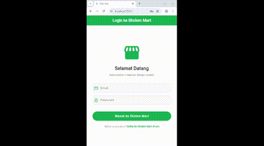

# Responsi 2 Mobile
## Paket 2

```
Nama        : Imedia Sholem Shoukat
NIM         : H1D023088
Shift Baru  : D
Shift KRS   : C
```

## Video Demo


## 🔌 Spesifikasi API

Backend dibangun menggunakan Framework **CodeIgniter 4**. Berikut adalah dokumentasi endpoint yang digunakan:

### A. Autentikasi
#### 1. Registrasi
* **Endpoint:** `/registrasi`
* **Method:** `POST`
* **Header:** `Content-Type: application/json`
* **Body:**
    ```json
    {
        "nama": "Nama User",
        "email": "user@email.com",
        "password": "password123"
    }
    ```
* **Response:**
    ```json
    {
        "code": 200,
        "status": true,
        "data": "Registrasi Berhasil"
    }
    ```

#### 2. Login
* **Endpoint:** `/login`
* **Method:** `POST`
* **Body:**
    ```json
    {
        "email": "user@email.com",
        "password": "password123"
    }
    ```
* **Response:**
    ```json
    {
        "code": 200,
        "status": true,
        "data": {
            "token": "auth_token_string",
            "user": {
                "id": "1",
                "email": "user@email.com",
                "nama": "Nama User"
            }
        }
    }
    ```

### B. Inventaris (CRUD)
#### 1. List Inventaris (Read All)
* **Endpoint:** `/inventaris`
* **Method:** `GET`
* **Response:**
    ```json
    {
        "code": 200,
        "status": true,
        "data": [
            {
                "id": "1",
                "nama": "Tepung Terigu",
                "harga": "12000",
                "jumlah": "50",
                "tanggal_masuk": "2023-12-01",
                "tanggal_kedaluwarsa": "2024-12-01"
            },
            ...
        ]
    }
    ```

#### 2. Tambah Inventaris (Create)
* **Endpoint:** `/inventaris`
* **Method:** `POST`
* **Body:**
    ```json
    {
        "nama": "Gula Pasir",
        "harga": "15000",
        "jumlah": "100",
        "tanggal_masuk": "2023-12-05",
        "tanggal_kedaluwarsa": "2025-01-01"
    }
    ```

#### 3. Detail Inventaris (Read One)
* **Endpoint:** `/inventaris/{id}`
* **Method:** `GET`

#### 4. Update Inventaris (Update)
* **Endpoint:** `/inventaris/{id}`
* **Method:** `PUT`
* **Body:** (Sama seperti Create)

#### 5. Hapus Inventaris (Delete)
* **Endpoint:** `/inventaris/{id}`
* **Method:** `DELETE`

---

## Penjelasan Flutter
### Struktur Projek
```text
lib/
├── bloc/
│   ├── inventaris_bloc.dart    # Logic CRUD Inventaris
│   ├── login_bloc.dart         # Logic Login
│   ├── logout_bloc.dart        # Logic Logout
│   └── registrasi_bloc.dart    # Logic Registrasi
├── helpers/
│   ├── api_url.dart            # Konstanta URL API
│   ├── api.dart                # Helper HTTP Request
│   ├── app_exception.dart      # Custom Error Handling
│   └── user_info.dart          # Helper Shared Preferences
├── model/
│   ├── inventaris.dart         # Model Data Barang
│   ├── login.dart              # Model Data Login
│   └── registrasi.dart         # Model Data Registrasi
├── ui/
│   ├── inventaris_detail.dart  # Tampilan Detail Barang
│   ├── inventaris_form.dart    # Tampilan Form (Tambah/Edit)
│   ├── inventaris_page.dart    # Tampilan Dashboard
│   ├── login_page.dart         # Tampilan Login
│   └── registrasi_page.dart    # Tampilan Registrasi
├── widget/
│   ├── success_dialog.dart     # Widget Dialog Sukses
│   └── warning_dialog.dart     # Widget Dialog Peringatan
└── main.dart                   # Entry Point Aplikasi
```

### Penjelasan Fungsi
Berikut adalah penjelasan detail mengenai fungsi-fungsi utama dalam aplikasi beserta potongan kodenya.

#### 1. Helpers (`lib/helpers/`)

##### a. `api.dart`
Class ini bertugas menangani koneksi HTTP ke server backend.

* **Fungsi `post(url, data)`**: Mengirim data ke server (Login, Register, Simpan Data) menggunakan method POST.
```dart
    Future<dynamic> post(dynamic url, dynamic data) async {
      var token = await UserInfo().getToken(); // Ambil token
      var response = await http.post(
        Uri.parse(url),
        body: data,
        headers: {HttpHeaders.authorizationHeader: "Bearer $token"},
      );
      return _returnResponse(response);
    }
```

* **Fungsi `get(url)`**: Mengambil data dari server (List Data) menggunakan method GET.
    ```dart
    Future<dynamic> get(dynamic url) async {
      var token = await UserInfo().getToken();
      var response = await http.get(
        Uri.parse(url),
        headers: {HttpHeaders.authorizationHeader: "Bearer $token"},
      );
      return _returnResponse(response);
    }
    ```

##### b. `user_info.dart`
Class ini mengelola penyimpanan data sesi lokal menggunakan `SharedPreferences`.

* **Fungsi `setToken` & `getToken`**: Menyimpan dan mengambil token autentikasi.
    ```dart
    Future setToken(String value) async {
      final SharedPreferences pref = await SharedPreferences.getInstance();
      return pref.setString("token", value);
    }
    ```

* **Fungsi `setNama` & `getNama`**: Menyimpan nama user agar bisa ditampilkan dinamis di Drawer.
    ```dart
    Future setNama(String value) async {
      final SharedPreferences pref = await SharedPreferences.getInstance();
      return pref.setString("nama", value);
    }
    ```

#### 2. Model (`lib/model/`)

##### a. `inventaris.dart`
Memetakan format JSON dari API menjadi objek yang bisa dibaca Flutter.

* **Fungsi `fromJson`**: Mengonversi Map (JSON) ke Object Inventaris.
    ```dart
    factory Inventaris.fromJson(Map<String, dynamic> obj) {
      return Inventaris(
        id: obj['id']?.toString(),
        nama: obj['nama'],
        harga: int.tryParse(obj['harga'].toString()),
        jumlah: int.tryParse(obj['jumlah'].toString()),
        tanggalMasuk: obj['tanggal_masuk'],
        tanggalKedaluwarsa: obj['tanggal_kedaluwarsa'],
      );
    }
    ```

#### 3. Bloc (`lib/bloc/`)
Jembatan antara UI dan API (Business Logic).

##### a. `login_bloc.dart`
* **Fungsi `login`**: Mengirim email dan password ke endpoint login.
    ```dart
    static Future<Login> login({String? email, String? password}) async {
      String apiUrl = ApiUrl.login;
      var body = {"email": email, "password": password};
      var response = await Api().post(apiUrl, body);
      var jsonObj = json.decode(response.body);
      return Login.fromJson(jsonObj);
    }
    ```

##### b. `inventaris_bloc.dart`
* **Fungsi `getInventaris`**: Mengambil list barang dan mengubahnya jadi List Object.
    ```dart
    static Future<List<Inventaris>> getInventaris() async {
      String apiUrl = ApiUrl.listInventaris;
      var response = await Api().get(apiUrl);
      var jsonObj = json.decode(response.body);
      List<dynamic> listData = (jsonObj as Map<String, dynamic>)['data'];
      List<Inventaris> inventarisList = [];
      for (int i = 0; i < listData.length; i++) {
        inventarisList.add(Inventaris.fromJson(listData[i]));
      }
      return inventarisList;
    }
    ```

* **Fungsi `addInventaris`**: Mengirim data barang baru ke server.
    ```dart
    static Future addInventaris({Inventaris? inventaris}) async {
      String apiUrl = ApiUrl.createInventaris;
      var body = {
        "nama": inventaris!.nama,
        "harga": inventaris.harga.toString(),
        "jumlah": inventaris.jumlah.toString(),
        "tanggal_masuk": inventaris.tanggalMasuk,
        "tanggal_kedaluwarsa": inventaris.tanggalKedaluwarsa,
      };
      var response = await Api().post(apiUrl, body);
      // ... return status
    }
    ```

#### 4. UI (`lib/ui/`)

##### a. `login_page.dart`
* **Fungsi `_submit`**: Dijalankan saat tombol Login ditekan. Memvalidasi, request API, simpan sesi, dan pindah halaman.
    ```dart
    void _submit() {
      LoginBloc.login(email: _email.text, password: _pass.text).then((value) async {
        if (value.code == 200) {
          await UserInfo().setToken(value.token.toString());
          await UserInfo().setNama(value.nama ?? "Admin"); // Simpan Nama
          Navigator.pushReplacement(context, MaterialPageRoute(...));
        }
      }, ...);
    }
    ```

##### b. `inventaris_page.dart` (Dashboard)
* **Fungsi `_loadUserInfo`**: Mengambil nama user dari memori HP untuk ditampilkan di Drawer.
    ```dart
    void _loadUserInfo() async {
      String? nama = await UserInfo().getNama();
      String? email = await UserInfo().getEmail();
      setState(() {
        _nama = nama ?? "Admin";
        _email = email ?? "admin@toko.com";
      });
    }
    ```

* **Fungsi `build` (FutureBuilder)**: Menampilkan loading saat data diambil, dan list saat data siap.
    ```dart
    FutureBuilder<List<Inventaris>>(
      future: InventarisBloc.getInventaris(),
      builder: (context, snapshot) {
        if (snapshot.hasError) return Text("Error");
        return snapshot.hasData 
           ? ListInventaris(list: snapshot.data) 
           : CircularProgressIndicator();
      },
    )
    ```

##### c. `inventaris_form.dart`
* **Fungsi `simpan`**: Logika untuk menyimpan data baru.
    ```dart
    void simpan() {
      Inventaris createInventaris = Inventaris(id: null);
      createInventaris.nama = _namaTextboxController.text;
      // ... isi field lain
      InventarisBloc.addInventaris(inventaris: createInventaris).then((value) {
        Navigator.of(context).pushReplacement(...); // Kembali ke List
      });
    }
    ```

* **Fungsi `ubah`**: Logika untuk mengupdate data yang sudah ada.
    ```dart
    void ubah() {
      // ... set data
      InventarisBloc.updateInventaris(inventaris: updateInventaris).then((value) {
        // Kembali ke detail dengan data terbaru
        Navigator.of(context).pushReplacement(
          MaterialPageRoute(builder: (context) => InventarisDetail(inventaris: updateInventaris))
        );
      });
    }
    ```

